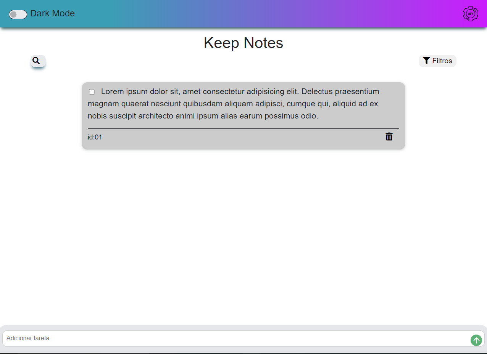
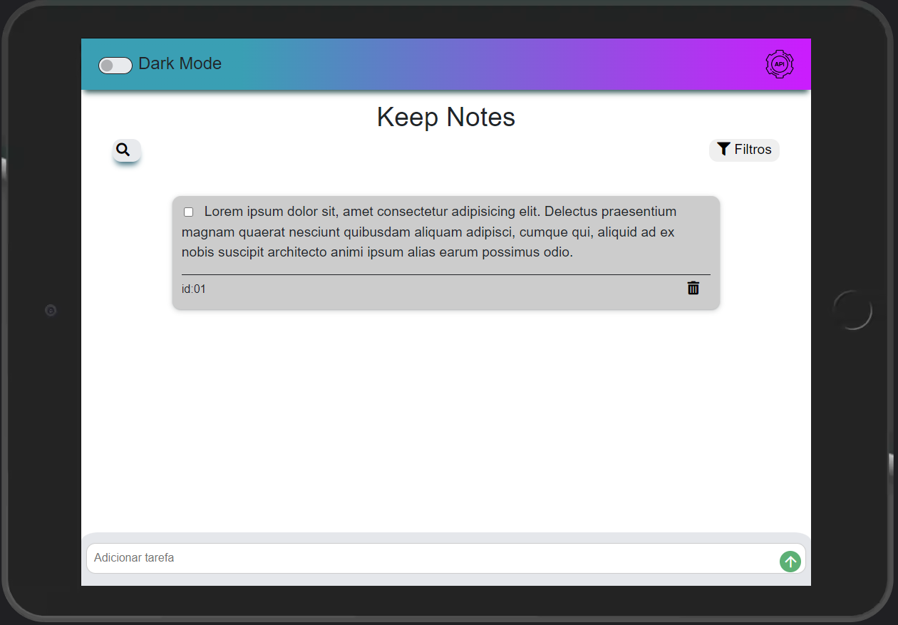
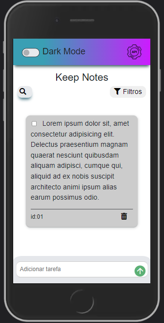

<div align="center" id="top">
  

  &#xa0;
  <a href="https://juniorvilas.github.io/CheckPoint2-FrontEnd2_Grupo01">Demo</a>
</div>  
  
<h1 align="center"> Lista To Do - Chechpoint 2 Frontend 2</h1>
<h2 align="center" style="bold">## Os arquivos do projeto estão na branch master</h2>
<hr>

<p align="center">
  <a href="#-sobre">Sobre</a> &#xa0; | &#xa0;
  <a href="#telas-da-aplicação">Telas</a> &#xa0; | &#xa0;
  <a href="#skateboard-funcionalidades">Funcionalidades</a> &#xa0; | &#xa0;
  <a href="#rocket-tecnologias">Tecnologias</a> &#xa0; | &#xa0;
  <a href="#checkered_flag-iniciando">Iniciando</a> &#xa0; | &#xa0;
  <a href="#memo-licença">Licença</a> &#xa0; | &#xa0;
  <a href="https://github.com/juniorvilas" target="_blank">Autor</a>
</p>

<br>

## 😸 Sobre ##

Projeto desenvolvido durante as aulas da DH referente ao Checkpoint 2 patrocinado pela <a href="https://www.digitalhouse.com/br"> Digital House</a>.
O objetivo do projeto era cria uma lista todo utilizando JavaSript, CSS, HTML.

## Telas da aplicação

### Tablet ##



## Mobile ##

 

## :skateboard: Funcionalidades ##

:heavy_check_mark: Adicionar uma nova tarefa\
:heavy_check_mark: Marcar essa tarefa como Done\
:heavy_check_mark: Excluir uma tarefa\
:heavy_check_mark: Aplicação responsiva

## :rocket: Tecnologias ##

Abaixo poderá ter acesso às principais tecnologias usadas neste projeto

- [JavaScript](https://developer.mozilla.org/pt-BR/docs/Web/JavaScript/)
- [CSS](https://www.w3schools.com/css//)
- [HTML5](https://developer.mozilla.org/pt-BR/docs/Web/HTML/)
- [JSON](https://www.w3schools.com/js/js_json_intro.asp/)


## :checkered_flag: Iniciando ##

```bash
# Clone este projeto
$ git clone https://github.com/juniorvilas/CheckPoint2-FrontEnd2_Grupo01.git

# Acesse
$ cd CheckPoint2-FrontEnd2_Grupo01

```

## :memo: Licença ##

Este projeto está sob licença MIT. Para mais informações acesse [LICENSE](LICENSE.md).

Feito com :heart: por <a href="https://github.com/juniorvilas" target="_blank">Carlindo Junior</a>

&#xa0;

<a href="#top">Voltar ao topo</a>
